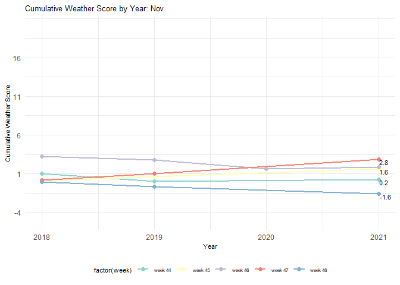

Maximizing Enjoyment: Reducing Wait Times at Walt Disney World
================
2024-05-18

Group 4 - Jacomo Corrieri, Kim Minyeong, Lee Jimin

------------------------------------------------------------------------

0.) Loading libraries

\[Reading in each data set\]

The data sets are extremely large, so we need to trim them down to
usable subsets while still fairly representing the data.

Waiting_times - 3,509,324 obs. of 14 variables Weather_data - 207264
obs. of 28 variables

### Analyzing Waiting Times Data.

    ##  [1] "WORK_DATE"                "DEB_TIME"                
    ##  [3] "DEB_TIME_HOUR"            "FIN_TIME"                
    ##  [5] "ENTITY_DESCRIPTION_SHORT" "WAIT_TIME_MAX"           
    ##  [7] "NB_UNITS"                 "GUEST_CARRIED"           
    ##  [9] "CAPACITY"                 "ADJUST_CAPACITY"         
    ## [11] "OPEN_TIME"                "UP_TIME"                 
    ## [13] "DOWNTIME"                 "NB_MAX_UNIT"

To begin our pre-processing, we wanted to get a good idea of how we
could trim the data contained in the waiting times data set while
preserving as much as possible.

### Determining the Number of Recorded Rides

    ## all_rides
    ##   Aeroplane Ride      Bumper Cars      Bungee Jump     Circus Train 
    ##                1                1                1                1 
    ##        Crazy Bus      Crazy Dance    Dizzy Dropper       Drop Tower 
    ##                1                1                1                1 
    ##   Flying Coaster        Free Fall      Giant Wheel     Giga Coaster 
    ##                1                1                1                1 
    ##         Go-Karts          Gondola    Haunted House    Himalaya Ride 
    ##                1                1                1                1 
    ## Inverted Coaster   Kiddie Coaster        Log Flume   Merry Go Round 
    ##                1                1                1                1 
    ##         Monorail       Oz Theatre      Pirate Ship      Power Tower 
    ##                1                1                1                1 
    ##      Rapids Ride   Reverse Bungee   Roller Coaster       Scooby Doo 
    ##                1                1                1                1 
    ##           Skyway       Sling Shot Spinning Coaster     Spiral Slide 
    ##                1                1                1                1 
    ##    Superman Ride       Swing Ride     Tilt-A-Whirl         Top Spin 
    ##                1                1                1                1 
    ##    Vertical Drop       Water Ride          Zipline 
    ##                1                1                1

    ## Number of unique rides: 39

It seems like there are 39 unique rides listed in waiting_times,
however..

    ## # A tibble: 2 × 4
    ## # Rowwise: 
    ##   WORK_DATE  DEB_TIME                num_rides ride_names                       
    ##   <chr>      <chr>                       <int> <chr>                            
    ## 1 2022-06-08 2022-06-08 22:45:00.000        37 Skyway, Spinning Coaster, Rapids…
    ## 2 2022-06-09 2022-06-09 09:00:00.000        39 Power Tower, Giga Coaster, Rever…

    ## [1] "Vertical Drop" "Tilt-A-Whirl"

Two attractions(“Vertical Drop”, “Tilt-A-Whirl”) increased from 37 to 39
on June 9th of 2022.

Knowing this, we wanted to see how many entries per day exist in the
data set:

    ## # A tibble: 6 × 2
    ##   WORK_DATE  count
    ##   <chr>      <int>
    ## 1 2018-01-01  2072
    ## 2 2018-01-02  2072
    ## 3 2018-01-03  2072
    ## 4 2018-01-04  2072
    ## 5 2018-01-05  2072
    ## 6 2018-01-06  2072

There are ~2072 entries per day, so (2072 entries) \* (1,691 rows) =
3.5M obs.

When looking at the different columns, we can see that several of them
deal with the time data. First, we wanted to see if any of these columns
were redundant.

### Looking at waiting_times DEB_TIME and FIN_TIME

Every FIN_TIME shows the time which is 15 minutes after of DEB_TIME.

Also, every DEB_TIME is recorded in 15 minutes interval.

It means the observations are recorded in 15 minute intervals.

### Finding out how to condense the data set - trimming by time of day

Here, we wanted to check the first and last times listed in the day.
This gives us a range of time when the park is operating, or at least
for the entries are being recorded.

Every first DEB_TIME, the beginning of the 15 minute observation, is
entered at 9am. The last recorded observations are at 22:45pm.

With this information in mind, we came up with the idea to change the
recorded time information for each ride entry into a categorical column.
This new column, ‘TIME_OF_DAY’, will split the time data into four
categories: ‘Dawn’, ‘Morning’, ‘Afternoon’, ‘Night’.

DEB_TIME_HOUR shows the hour part of DEB_TIME, so we no longer need
DEB_TIME.

FIN_TIME is also not needed, now that we know it only represents the end
of the recorded observation. We only need the hour data.

Therefore, ‘FIN_TIME’ and ‘DEB_TIME’ are redundant columns which are
okay to be deleted.

The time range of the observations (9am to 22:45pm) is 13 hours. When we
divide this into three, it is 4 hours 20 minutes for each. However, we
cannot use 20 minutes unit because the “waiting_times” is recorded in 15
minutes intervals and “weather_data” is recorded in 1 hour interval.

So, we split 4-5-5 hours for each categories considering common sense of
lunch and dinner time.

### TIME_OF_DAY

- Night \[23 ~ 08\] \[23, 9) \<- Park isn’t operating

- Morning \[09 ~ 12\] \[9, 13) = 4 hours

- Afternoon \[13 ~ 17\] \[13, 18) = 5 hours

- Evening \[18 ~ 22\] \[18, 23) = 5 hours

To do this, we used cut() to split up and average the waiting_times
information across these categories.

    ## # A tibble: 6 × 12
    ##   WORK_DATE  TIME_OF_DAY ENTITY_DESCRIPTION_SHORT AVG_WAIT_TIME NB_UNITS
    ##   <chr>      <fct>       <chr>                            <dbl>    <dbl>
    ## 1 2018-01-01 Morning     Aeroplane Ride                    8.12    20   
    ## 2 2018-01-01 Morning     Bumper Cars                       5       18   
    ## 3 2018-01-01 Morning     Bungee Jump                       5.94     3.89
    ## 4 2018-01-01 Morning     Circus Train                      4.69     1   
    ## 5 2018-01-01 Morning     Crazy Bus                        16.9      4.68
    ## 6 2018-01-01 Morning     Crazy Dance                       4.69     1   
    ## # ℹ 7 more variables: GUEST_CARRIED <dbl>, CAPACITY <dbl>,
    ## #   ADJUST_CAPACITY <dbl>, OPEN_TIME <dbl>, UP_TIME <dbl>, DOWNTIME <dbl>,
    ## #   NB_MAX_UNIT <dbl>

We also updated the column names to better reflect the data.

    ##  [1] "DATE"              "TIME_OF_DAY"       "RIDE"             
    ##  [4] "AVG_WAIT_TIME"     "NB_UNITS"          "GUESTS_CARRIED"   
    ##  [7] "CAPACITY"          "ADJUSTED CAPACITY" "OPEN_TIME"        
    ## [10] "UPTIME"            "DOWNTIME"          "MAX_UNITS"

This is the end of our general pre-processing for waiting_times. Now, we
need to see what we can do to trim the weather data and prepare it to be
merged.

### Columns Which Contain Unique Values

First, let’s figure out columns which only contains only one unique
value. These columns will be removed from the weather data.

    ## Removing: city_name  Removing: lat  Removing: lon  Removing: visibility  Removing: sea_level  Removing: grnd_level  Removing: snow_3h

### Different columns with different formats.

The columns ‘dt’ and ‘dt_iso’ contain the same information. ‘dt’ is a
unix timestep(s) after 1970-1-1 time 00:00:00 UTC. ‘dt_iso’ is the date
and time  
given in ISO 8601 standard format. We can check it with the code below
as well. It shows ‘dt’ can be converted into ‘dt_iso’ using 10 rows.

    ## [1] "dt data"

    ## [1] 915148800 915152400 915156000 915159600 915163200 915166800

    ## [1] "dt_iso data"

    ## [1] "1999-01-01 00:00:00 UTC" "1999-01-01 01:00:00 UTC"
    ## [3] "1999-01-01 02:00:00 UTC" "1999-01-01 03:00:00 UTC"
    ## [5] "1999-01-01 04:00:00 UTC" "1999-01-01 05:00:00 UTC"

Continuing on, we noticed that ‘weather_id’ and ‘weather_description’
mean the same thing, just as different data types (integer and
character)

    ##    weather_id weather_description
    ## 1         800        sky is clear
    ## 3         801          few clouds
    ## 4         802    scattered clouds
    ## 5         803       broken clouds
    ## 11        804     overcast clouds
    ## 33        500          light rain

Weather icon and weather description represent the same information. So,
we have decided to remove the weather icon column and keep the string
descriptors.

    ##     weather_description weather_icon
    ## 112        sky is clear          01d
    ## 1          sky is clear          01n
    ## 111          few clouds          02d
    ## 3            few clouds          02n
    ## 14     scattered clouds          03d
    ## 4      scattered clouds          03n

After everything, 10 columns were removed from weather data.

    ## Original Weather Data # of columns: 28

    ## New Weather Data # of columns: 18

Updating weather_data

In order to work towards combining each data set, we want to find a
common variable. Based on our initial analysis, both data sets contain
detailed date and time information. However, there are some
discrepancies in the format and the time span.

First, let’s standardize the given time in weather_data removing the UTC
information, as each entry has the same value (+0000 UTC).

    ## New time format: 1999-01-01 00:00:00

Here, we’re analyzing the weather time data to see how it is entered. By
taking the unique times listed, we discovered that the data is recorded
by hour in 24-hour format.

    ##  [1] "00:00:00" "01:00:00" "02:00:00" "03:00:00" "04:00:00" "05:00:00"
    ##  [7] "06:00:00" "07:00:00" "08:00:00" "09:00:00" "10:00:00" "11:00:00"
    ## [13] "12:00:00" "13:00:00" "14:00:00" "15:00:00" "16:00:00" "17:00:00"
    ## [19] "18:00:00" "19:00:00" "20:00:00" "21:00:00" "22:00:00" "23:00:00"
    ## [25] NA

Reformatting the date column into a DATE variable and storing the data
in a new column DATE. We are also storing just the hour from the given
time info, as the minutes and seconds are redundant and contain zero for
each entry.

Now that we’ve done some work reformatting our time data, we could check
the range of each data set.

    ## [1] "The date range of 'weather_data'"

    ## Min date:  1999-01-01

    ## Max date:  2022-08-23

    ## [1] "The date range of 'waiting_times'"

    ## Min date:  2018-01-01

    ## Max date:  2022-08-18

As shown, each data set spans a different range of time. Since our main
focus is on the ride data provided in waiting_times, we decided to trim
the weather data to match it.

We can thus remove the weather from 1999 to 2017

### Trimming weather_data from 2018 onward to align with waiting_times range

    ## [1] "The date range of 'weather_data'"

    ## Min date:  2018-01-01

    ## Max date:  2022-08-18

Processing weather_data further, we noticed a variable called
“weather_main” which summarized the given weather descriptions into the
following categories:

    ## [1] "Clouds" "Clear"  "Rain"   "Snow"

However, we chose to keep the more detailed descriptions of the weather
to distinguish its varying intensity, as it may lead to better insights.

We changed the ‘weather_main’ column to keep a summarized collection of
each category, distinguishing the weather as follows: Clear, Cloudy,
Light Rain/Snow, Moderate or Heavy Rain/Snow.

This gives us a concise description of the weather for each day.

    ## [1] Clear                       Cloudy                     
    ## [3] Light Rain/Snow             Moderate or Heavy Rain/Snow
    ## Levels: Clear Cloudy Light Rain/Snow Moderate or Heavy Rain/Snow

### Reducing the size of weather_data by splitting the time into categories

To apply the weather information to the “waiting_times”, we have to use
the same criteria as we used in “waiting_times.”

This way, we can reduce the size of the weather data further while also
preparing some common columns (DATE and TIME_OF_DAY) to join the data
sets together.

### TIME_OF_DAY \[“weather_data” criteria\] \[“waiting_times” criteria)

- Night \[23 ~ 08\] \[23, 9)
- Morning \[09 ~ 12\] \[9, 13) = 4 hours
- Afternoon \[13 ~ 17\] \[13, 18) = 5 hours
- Evening \[18 ~ 22\] \[18, 23) = 5 hours

Now that we have the data that we need from both waiting_times and
weather_data, we can prepare to merge the data sets.

We decided to filter out all weather data that occurred during the
“night” time of day as there are no waiting time entries during that
period.

Finally, we could perform a left join between the wait and weather data,
combining them via the DATE and TIME_OF_DAY columns.

We also want to create a column, SEASON, so that we can compare seasonal
data and identify seasonality. By using the lubridate package, we are
able to extract the weekday, month, and year for each entry.

    ##  [1] "DATE"                "YEAR"                "MONTH"              
    ##  [4] "WDAY"                "SEASON"              "TIME_OF_DAY"        
    ##  [7] "RIDE"                "AVG_WAIT_TIME"       "NB_UNITS"           
    ## [10] "GUESTS_CARRIED"      "CAPACITY"            "ADJUSTED CAPACITY"  
    ## [13] "OPEN_TIME"           "UPTIME"              "DOWNTIME"           
    ## [16] "MAX_UNITS"           "AVG_TEMP"            "FEELS_LIKE"         
    ## [19] "TEMP_MIN"            "TEMP_MAX"            "WIND_SPD"           
    ## [22] "AVG_HUMIDITY"        "WEATHER_DESCRIPTION" "HAS_RAIN"

With the final modifications made to our combined data set, we could
develop some inquiries we wanted to investigate further, including a
main theme for this project:

Suppose that Jimin and Minyeong want to visit Jacomo in Florida to go to
Disney World. When would be the best time to come? During which
conditions? Which rides should they ride, and when would be the best
time of day?

While entertaining, this scenario is a realistic use case for the
analysis of our data, and we hoped to adequately solve these questions
through our work. However, we also developed some more general inquiries
that were more technically-oriented:

What variables have a visible linear effect on the average waiting
times?

During which seasons, months, and days is the park busiest?

------------------------------------------------------------------------

# EDA Graphs, Plots, and Explanations

Grouping wait times by day and month using a heat map.

We can get an idea of the trend of this data across each relevant year
using facet_wrap().

<!-- -->

We immediately noticed the gaps during the Spring and Winter seasons of
2020 and 2021, where the average waiting time seems to be nearly zero.
We wanted to understand this further.

Our logical assumption was that, due to COVID-19, the park must have
been closed during these periods, resulting in the average wait time
appearing to be zero. However, we needed to find some evidence in the
numbers themselves that would support our idea of a park closure.

The reason that this is important is because we want to find out the
trend of the average wait time while the park is open and running. Data
gathered when nobody was in attendance only serves to skew our mean
average wait time (and other important data) across all rides,
especially those periods where a large amount of zeroes are decreasing
the overall average wait time. This could lead to inaccurate findings.

To verify this, we simplified the data set and manually reviewed the
entries. We used the built-in column sort to search by descending number
of units (NB_UNITS), where we could see a majority of the empty data.

We could see that as the lock down was starting, there were fewer and
fewer entries with data above zero for columns such as guests_carried,
open_time, and the number of units. Eventually, this trend disappeared
and we found large sequences of entries holding zero for all metrics
that matched up with the observed time periods on our heat map.

To be as fair as possible, we decided to remove only the entries that
held zero for every relevant numeric column.

Columns 8:15 include: AVG_WAIT_TIME, NB_UNITS, GUESTS_CARRIED, CAPACITY,
ADJUSTED_CAPACITY, OPEN_TIME, UPTIME, DOWNTIME

<!-- -->

Comparing this to the original graph, the trend remains the same.
Therefore, removing the data affected by COVID still preserves the data
set’s integrity.

Here is an updated table accompanying the graph. Looking at the busiest
weekdays, it appears many lie on a Saturday, which is initially what we
expected.

    ## # A tibble: 6 × 3
    ##   WDAY  MONTH  wait
    ##   <ord> <ord> <dbl>
    ## 1 Sat   Mar    27.8
    ## 2 Sat   Nov    25.8
    ## 3 Sat   Jun    25.7
    ## 4 Sat   Dec    25.6
    ## 5 Tue   Aug    24.6
    ## 6 Sat   Apr    24.5

Next, we created a basic graph showing an overview of the wait times
across all rides by year. The general trend confirms that waiting times
were, on average, much lower due to COVID during 2020 and 2021 (We can
see that in the Spring it reached zero).

<!-- -->

------------------------------------------------------------------------

With a better understanding and basic visualization of our data, we
began to investigate our main theme - finding the best day and time to
visit Disney World.

To start, we wanted to narrow down our search for the lowest waiting
times by looking at each season. We created a bar plot and accompanying
table to do this.

<!-- -->

    ## # A tibble: 4 × 2
    ##   SEASON Average_Wait
    ##   <chr>         <dbl>
    ## 1 Fall           16.5
    ## 2 Spring         19.9
    ## 3 Summer         20.8
    ## 4 Winter         18.2

We can see that Summer has the highest waiting time, and that fall has
the lowest. For our purposes, we want to investigate the waiting times
of both the Fall (since it is the season with objectively the lowest
average wait time) but also the Winter (second lowest season), as for
Jimin and Minyeong it would better align with their Winter break as
students.

From this point, we wanted to use our weather data to determine its
effect on the wait times of rides. While our data set includes data
about snow, the hot environment in Florida makes this incredibly rare,
so we are focused primarily on the effect of rain.

This table shows the numerical difference in waiting times and open
times with the presence of rain (compared to when rain is absent)

    ##             RIDE avg_wait_time_difference open_time_difference
    ## 1 Aeroplane Ride                 -11.5625           0.55578464
    ## 2    Bumper Cars                 -17.5000           0.22734445
    ## 3    Bungee Jump                 -27.7500           0.04315522
    ## 4   Circus Train                 -21.7500          -0.10838087
    ## 5      Crazy Bus                 -23.1875           0.47494563
    ## 6    Crazy Dance                 -16.3750           0.14048036

The following plot visualizes the effect of rain on the maximum waiting
time of each ride.

<!-- -->

From this result, we can see that open time and down time are not that
largely influenced by rain. However, max of avg waiting time is largely
effected by rain. We can see that almost every ride decreased their
waiting time when the weather is rainy. So we can conclude that we can
wait less and enjoy more on little bit rainy days.

### Finding the Best Month

Following the main theme of our report, we are okay even with light rain
or snow but don’t want heavy rain, hoping to ride as many attractions as
we can in decent conditions. According to this preference, we gave each
weather_data\$weather_description a subjective score.

Then, we averaged the score, making a new temporary data frame, ‘df’.

Filter out August 2022 because there is no whole month data on August
2022.

    ## # A tibble: 1,044 × 3
    ##    DATE        wait weather
    ##    <date>     <dbl>   <dbl>
    ##  1 2018-01-01  14.4  -0.883
    ##  2 2018-01-02  23.0  -1.53 
    ##  3 2018-01-03  24.0   0.133
    ##  4 2018-01-04  22.1  -1.57 
    ##  5 2018-01-05  25.9  -1.1  
    ##  6 2018-01-06  20.8  -1.53 
    ##  7 2018-01-07  14.1  -1.13 
    ##  8 2018-01-08  14.1  -0.567
    ##  9 2018-01-09  11.5  -1.2  
    ## 10 2018-01-10  10.4  -1    
    ## # ℹ 1,034 more rows

<!-- -->

In a boxplot of monthly weather score, it’s showing more dynamic
difference of weather score. Summer and spring have one of the highest
weather score, which means the weather is nice, but fall and winter are
showing lower score. In fall, score distribution are quite even whereas
January shows explicitly low weather score in winter. So we decided to
compare February, March, September, October, and November in more
detailed using weekly plot.

We used a accumulated weather score of each weeks by years. However, as
the year is later, the probability that weather would be similar as
feature increases. So, we used weighted sum making later year weather
score affects more than earlier year weather score.

    ## [1] "min:. -4.34 , max: 19.309781420765"

<!-- --><!-- --><!-- --><!-- --><!-- --><!-- -->

February and September shows high weather cumulative weather score, at
13.4 and 19.3 respectively. The last two weeks of February and first
week and last week of September showed significantly high weather score.
It could be obvious that those weeks are closer to the spring and
summer, but the last week of September is a quite meaningful results.

### Finding the Best Day in a Given Month

Now that we’ve narrowed down our choices, we can determine the best
possible day to visit each selected month. In order to do this, we can
take the mean average waiting time for each day in the month and select
the day with the lowest average waiting time.

<!-- -->

We can see here the differences in the average waiting time (for each
ride) during the best day as well as the total time spent waiting that
day in comparison to the average values. It is clear that while both
days significantly reduce the waiting time, Tuesdays in September are
the clear best option.

Here are the readjusted normalized wait times for each ride on Fridays
in February:

<!-- -->

And here are the readjusted normalized wait times for each ride on
Tuesdays in September. We can clearly see that both are better than the
original normalized times, though Tuesdays in September bring a vast
majority of the rides below the mean average wait time.

<!-- -->

Finally, we wanted to find the best time of day to ride the top five
rides in each month (based on the highest mean waiting time).

    ## # A tibble: 5 × 4
    ##   RIDE         MEAN_WAIT WDAY  MONTH
    ##   <chr>            <dbl> <ord> <ord>
    ## 1 Spiral Slide      43.4 Fri   Feb  
    ## 2 Monorail          43.2 Fri   Feb  
    ## 3 Giant Wheel       30.0 Fri   Feb  
    ## 4 Swing Ride        29.8 Fri   Feb  
    ## 5 Scooby Doo        25.8 Fri   Feb

    ## # A tibble: 5 × 4
    ##   RIDE           MEAN_WAIT WDAY  MONTH
    ##   <chr>              <dbl> <ord> <ord>
    ## 1 Monorail            33.1 Tue   Sep  
    ## 2 Spiral Slide        27.4 Tue   Sep  
    ## 3 Aeroplane Ride      23.9 Tue   Sep  
    ## 4 Giant Wheel         21.9 Tue   Sep  
    ## 5 Swing Ride          21.1 Tue   Sep

<!-- -->

In this very simplistic pie chart, we can clearly see that the best time
to ride the “busiest” rides would be in the evening.

------------------------------------------------------------------------

Based on our findings, we concluded the following: \* Rain tends to
result in decreased waiting times \* Jimin and Minyeong would prefer to
visit WDW on a Tuesday in September on either week 35 or 38, but may
have to come during February on Friday on week 9 (Winter Break, second
best option).

------------------------------------------------------------------------

# EDA - Deeper Analysis (Linear Regression and Clustering)

### Correlation Plot to Identify Variable Relationships

<!-- -->

The only meaningful relationship that may be able to be explored further
is the relationship between open time and the average wait time, which
has an apparent correlation of ~50%.

    ## 
    ## Call:
    ## lm(formula = OPEN_TIME ~ AVG_WAIT_TIME, data = open_main_df)
    ## 
    ## Residuals:
    ##     Min      1Q  Median      3Q     Max 
    ## -23.019  -2.993   1.167   3.633   6.415 
    ## 
    ## Coefficients:
    ##                Estimate Std. Error t value Pr(>|t|)    
    ## (Intercept)   8.5846720  0.0168754   508.7   <2e-16 ***
    ## AVG_WAIT_TIME 0.1312178  0.0006148   213.4   <2e-16 ***
    ## ---
    ## Signif. codes:  0 '***' 0.001 '**' 0.01 '*' 0.05 '.' 0.1 ' ' 1
    ## 
    ## Residual standard error: 4.515 on 136534 degrees of freedom
    ## Multiple R-squared:  0.2502, Adjusted R-squared:  0.2502 
    ## F-statistic: 4.555e+04 on 1 and 136534 DF,  p-value: < 2.2e-16

When creating a linear model between open time and wait time, we can see
that the relationship is significant, with an adjusted R-squared of
around 25%. From this, we can say that 25% of the variance in the
average waiting time can be explained by the open time.

So, while open time has the strongest correlation with waiting times, it
is still a fairly weak relationship.

### CLUSTERING

Clustering rides by avg open time and avg waiting time -\> By comparing
the clusters, we can see the correlation of waiting time and open time.

Making avg open time dataframe of rides

Scailing & k-means clustering

Plot the result

<!-- -->

Text result

    ## # A tibble: 3 × 2
    ##   cluster rides_in_cluster                                                      
    ##   <fct>   <chr>                                                                 
    ## 1 1       Free Fall, Inverted Coaster, Oz Theatre, Roller Coaster, Superman Ride
    ## 2 2       Aeroplane Ride, Circus Train, Crazy Bus, Giga Coaster, Gondola, Haunt…
    ## 3 3       Bumper Cars, Bungee Jump, Crazy Dance, Dizzy Dropper, Drop Tower, Fly…

Making avg waiting time dataframe of rides

Scailing & k-means clustering

Plot the result
<!-- -->

Text result

    ## # A tibble: 3 × 2
    ##   cluster rides_in_cluster                                                      
    ##   <fct>   <chr>                                                                 
    ## 1 1       Bumper Cars, Bungee Jump, Circus Train, Crazy Dance, Dizzy Dropper, F…
    ## 2 2       Aeroplane Ride, Crazy Bus, Drop Tower, Free Fall, Go-Karts, Inverted …
    ## 3 3       Giant Wheel, Monorail, Spiral Slide, Swing Ride, Tilt-A-Whirl

Comparing Longest open time cluster and Shortest waiting time cluster

    ## character(0)

Comparing Longest waiting time cluster and Shortest open time cluster

    ## character(0)

Since the correlation of waiting time and open time is 0.50, we thought
as the open time is long, the ride is operates for a long time and the
waiting time might be short. So We expected to check the correlation
between waiting time and open time by clustering rides by waiting time
and open time.

What can be observed from the clusters are the different groupings of
rides based on whether their waiting and open time are low, medium, or
high. However, the resulting intersection showed no matching ride that
is both included in the longest open time cluster and the shortest
waiting time cluster. There was also no cluster that is both included in
the longest waiting time cluster and shortest open time cluster.

We have found the correlation of open time and waiting time, but it was
hard to see the actual correlation from our data set.
